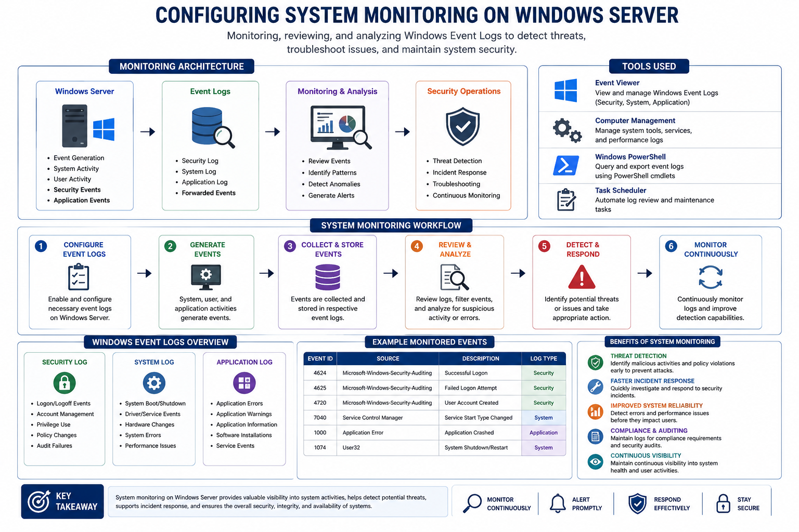

# Windows-Server-System-Monitoring-and-Event-Log-Analysis

## Project Overview
This project focused on configuring and monitoring Windows Server event logs to improve visibility, threat detection, and incident response capabilities within an enterprise environment.

## Architecture

## Tools Used
- Windows Server
- Windows Event Viewer
- Administrative Tools
- Virtualized Lab Environment

## Key Activities
- Configured and reviewed Windows Event Logs
- Monitored Security, System, and Application logs
- Investigated suspicious activities and system changes
- Learned how continuous monitoring supports threat detection and incident response
  

## Lessons Learned
- Developed practical experience with Windows Event Viewer
- Strengthened understanding of event log analysis
- Learned how monitoring supports SOC operations and threat detection
- Improved troubleshooting and analytical investigation skills

## Next Steps
- Integrate SIEM solutions
- Explore Sysmon logging
- Practice centralized logging and alerting
